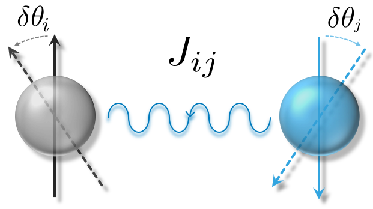

---
# Feel free to add content and custom Front Matter to this file.
# To modify the layout, see https://jekyllrb.com/docs/themes/#overriding-theme-defaults

layout: splash
author_profile: false
title: Jx
excerpt: The open source magnetic force theory (MFT) calculation project.
header:
  #overlay_image: /assets/images/unsplash-image-1.jpg
  #overlay_filter: rgba(5, 0, 196, 0.15)
  #caption: "Photo from: [PRB 2018](https://doi.org/10.1103/PhysRevB.97.125132)"
  #actions:
  #  - label: "More Info"
  #    url: "https://unsplash.com"
  #title: "test"
  #image: assets/images/Logo.svg
  overlay_image: assets/images/Logo_header.svg
  #overlay_image: /assets/images/install2.gif

  #overlay_color: rgba(0, 0, 196, 0.95)
  overlay_filter: "0.50"
  #overlay_filter: rgba(0, 0, 128, 0.15)

  #caption: "Photo credit: [**Unsplash**](https://unsplash.com)"
---
   

# **Jx**: The MFT software
**Jx** is open source package for calculating spin exchange coupling parameters *J*ij based on [MFT (Magentic force theory)](acknowledegment/#the-mft-history).

{:style="max-width: 450px"} <!--- #{:height="55%" width="55%" max-width=20px; } --->

The **Jx** is a user-friendly and efficient tool to calculate magnetic interaction in solids and molecules.
Key features are as follows:
1. Without calculating the supercell, it computes short- and long-term interactions.
1. It is also possible to calculate an orbital-resolved matrix form of magnetic couplings.

See [features](docs/feature) page for more detailed capabilities.

---
# [Usage and example](docs/#examples)

# [How to install](docs/#quick-start)
